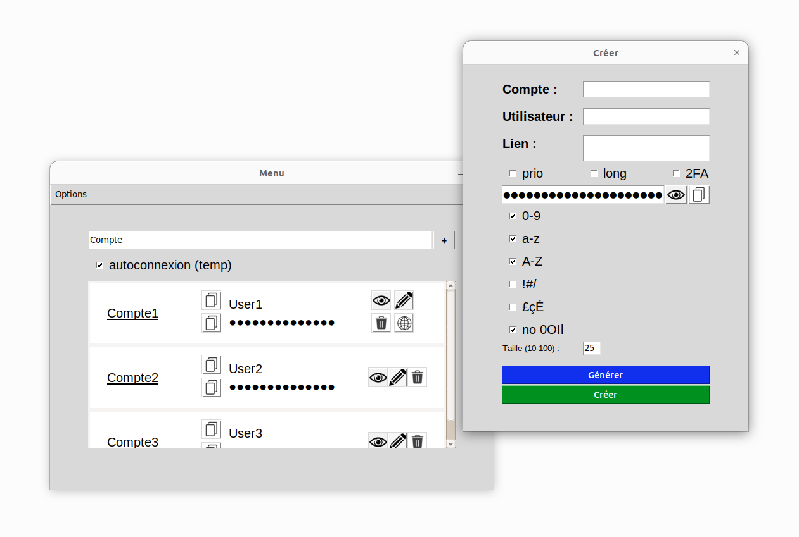
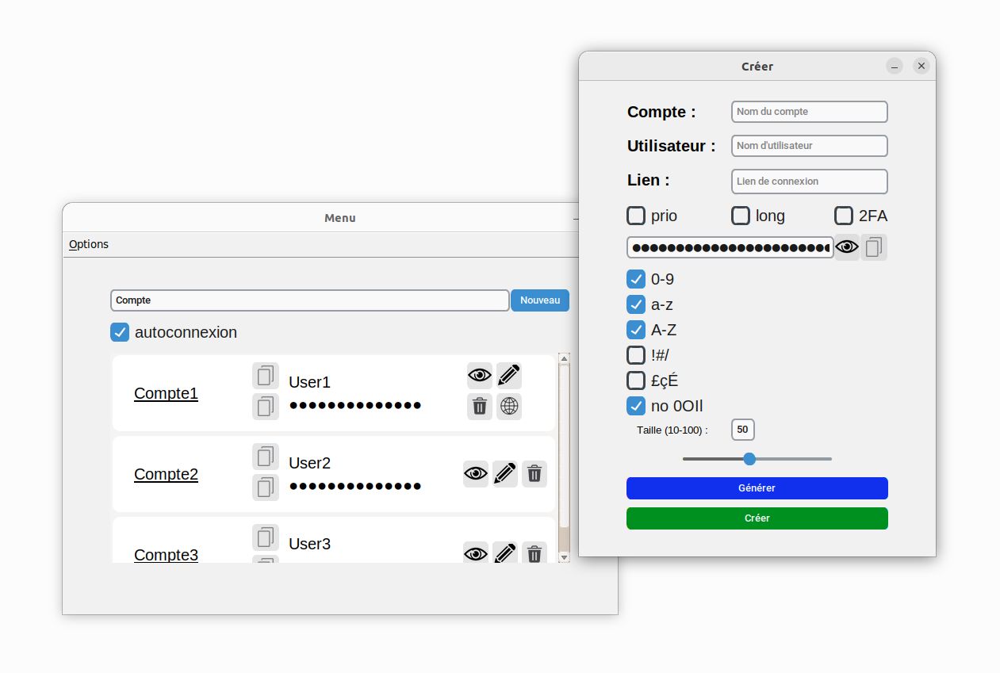

# gest_mdp
Gestionnaire de mots de passe avec connexion automatique

> [!NOTE]
> **Statut : maintenance uniquement.** J'utilise désormais [Bitwarden](https://bitwarden.com/) au quotidien et je recommande d'en faire autant pour un usage réel. Ce projet reste en ligne comme démonstration technique : dérivation de clé PBKDF2 (1 million d'itérations) + chiffrement Fernet, extension Firefox [publiée sur AMO](https://addons.mozilla.org/en-US/firefox/addon/gest_mdp/) et serveur local pour l'autocomplétion.

<table align="right">
  <tr><td><a href="README.md"> Français</a></td></tr>
  <tr><td><a href="README_en.md"> English</a></td></tr>
</table>

<details>
<summary><b> 🆕 - Nouveautés</b></summary><br>

### Dernière mise à jour 🔥

Nouvelle de technique pour faire de l'autocomplétion : le logiciel
utilise maintenant une extension pour faire de l'autocomplétion. 
Cette extension communique avec un serveur local géré par l'application.
L'extension détecte les pages de connexion et remplit automatiquement.
Le serveur lui, communique les informations de connexion à l'extension.
Cette nouvelle technique a pour avantage de résoudre de nombreux
problèmes présents auparavant avec Selenium, tels que :
+ l'obligation de lancer le navigateur dans un mode spécial depuis le logiciel
+ l'autocomplétion qui ne fonctionnait que dans le dernier onglet ouvert
+ l'impossibilité d'ouvrir plusieurs instances du navigateur
+ des problèmes de saisie de caractères accentués
+ le refus de certains sites de fonctionner en raison de la détection d'un navigateur en mode robot
+ la gestion manuelle des sites qui mettent du temps à charger avec l'option "long"
+ la boucle infinie en cas de mauvais mot de passe qui faisait le logiciel tenter de se connecter indéfiniment

Avec cette amélioration, tous ces problèmes sont désormais du passé. L'option
"long" étant devenue inutile, elle a été supprimée et remplacée par l'option
"submit". Cette option vous permet de décider site par site si vous voulez
que l'extension soumette automatiquement le formulaire de connexion ou
si cette dernière doit se contenter de remplir les champs.

L'extension est disponible sur le [store firefox](https://addons.mozilla.org/en-US/firefox/addon/gest_mdp/).

### Autres mises à jour 🎉

+ Nombreuses corrections de bugs et amélioration de la stabilité.
+ Nombreuses améliorations de l'interface graphique.
+ Ajouts de raccourcis claviers.
+ Génération automatique de mots de passe lors de changement de paramètres de génération.
+ Changement de l'interface graphique, passage de Tkinter à [CustomTkinter](https://github.com/TomSchimansky/CustomTkinter) :

#### Tkinter (avant) :<br>
<br>
#### CustomTkinter (après) :<br>


</details>

<details>
<summary><b> ‍⚙️ - Installation</b></summary><br>

```bash
git clone https://github.com/theodubus/gest_mdp.git
cd gest_mdp
pip install -r requirements.txt
```
Si vous voulez également profiter de la fonctionnalité
de connexion automatique, il faut installer une extension pour
votre navigateur. Pour cela, rendez-vous sur le 
[store firefox](https://addons.mozilla.org/en-US/firefox/addon/gest_mdp/).

Cette extension n'est pour le moment disponible que pour Firefox, 
faites-moi savoir si vous voulez que je la rende disponible pour
Chrome ou tout autre navigateur.

#### Opérations supplémentaires pour Linux
```bash
sudo apt install python3-tk
sudo apt install xclip
```

Ces opérations peuvent être nécessaires sous linux. La première ligne
sert à installer `Tkinter` dans le cas ou l'installation avec pip échoue.
La deuxième ligne sert à installer `xclip`, qui est utilisé pour pouvoir
copier des mots de passe dans le presse-papier.

</details>

<details>
<summary><b> 💻 - Accès au logiciel</b></summary><br>

### Linux
+ <ins>Option 1 :</ins> Lancer directement le programme depuis un terminal :
`python3 /path/to/gest_mdp/main.py`


+ <ins>Option 2 :</ins> Ajouter les droits d'exécution à `main.py`, puis créer un raccourci clavier contenant la
commande `/path/to/gest_mdp/main.py`


+ <ins>Option 3 :</ins> Utiliser le fichier `gest.desktop` fourni dans le dossier `additional_resources/`.
Il faut donner les droits d'exécution aux fichiers `gest.desktop` et `main.py`. Ensuite, il faut modifier les
chemins dans le fichier `gest.desktop` pour qu'ils correspondent à votre installation. Enfin, il faut copier le fichier
dans le dossier `~/.local/share/applications/`. Cette solution rendra l'application disponible dans la liste de vos
applications.

### Windows
+ <ins>Option 1 :</ins> Lancer directement le programme depuis un terminal :
`python C:\path\to\gest_mdp\main.py`


+ <ins>Option 2 :</ins> Utiliser le fichier `gest.bat` fourni dans le dossier `additional_resources/`.
Il faut modifier les chemins dans le fichier `gest.bat` pour qu'ils correspondent
à votre installation. Vous pouvez ensuite soit utiliser directement ce fichier,
soit créer un raccourci vers ce fichier, ce qui vous permettra de définir une
icône. Une image au bon format, `logo.ico` est également disponible dans le dossier
`additional_resources/`.

</details>

<details>
<summary><b> 🛠 - Fonctionnalités</b></summary><br>

### Ajouter un mot de passe

Vous pouvez stocker des nouveaux mots de passe en cliquant
sur le bouton `Nouveau` ou dans `Options > Données > Nouveau compte`. Seul le nom du compte
et le mot de passe sont obligatoires.

+ La case `Lien` correspond au lien vers la page de connexion si vous souhaitez
mettre en place la connexion automatique pour ce compte
(incluez le lien entier avec https://).

+ La case `prio` permet de définir une priorité pour la connexion automatique
(ex : si vous avez plusieurs comptes Amazon).

+ La case `submit` permet de préciser si vous voulez que le formulaire de connexion
soit soumis automatiquement ou si le logiciel doit seulement remplir les champs.

+ Les cases en dessous le champ de mot de passe correspondent aux
caractères à inclure ou non dans le mot de passe.

+ La case `no 0OIl` permet d'éviter les caractères similaires (ex : 0 et O).

Si vous ne souhaitez pas un mot de passe aléatoire,
il est possible de le saisir manuellement.

Si vous le mot de passe généré ne vous convient pas,
vous pouvez cliquer sur le bouton `Générer` pour en générer un nouveau.

### Modifier un mot de passe
Pour modifier un mot de passe, cliquez sur le bouton en forme de crayon
à côté du compte que vous souhaitez modifier. La modification suit les
mêmes règles que l'ajout.

### Supprimer un mot de passe
Pour supprimer un mot de passe, cliquez sur le bouton en forme de poubelle
à côté du compte que vous souhaitez supprimer.

### Générer un mot de passe sans l'enregistrer
Si vous souhaitez générer un mot de passe sans l'enregistrer, allez dans
`Options > Générer`. Les paramètres de génération de mot de passe sont
les mêmes que pour l'ajout d'un mot de passe.

### Connexion automatique
N'oubliez pas d'installer l'[extension](https://addons.mozilla.org/en-US/firefox/addon/gest_mdp/)
si vous souhaitez utiliser la connexion automatique.

Vous pouvez ouvrir un site internet en cliquant sur le bouton en forme de globe
à côté du compte que vous souhaitez ouvrir. La connexion automatique fonctionnera
uniquement pour les sites pour lesquels vous avez spécifié un lien de connexion.

Vous pouvez désactiver temporairement la connexion automatique en décochant la case 
`autoconnexion`. Cela aura pour effet d'éteindre le serveur local géré par l'application.

### Préférences
Vous pouvez modifier les préférences depuis `Options > Profil > Modifier Préférences`.
Depuis cette page, vous pouvez décider d'activer ou non par défaut la connexion automatique, d'inclure
par défaut certains types de caractères dans les mots de passe générés, etc.

### Modifier le mot de passe utilisateur
Vous pouvez modifier votre mot de passe depuis `Options > Profil > Sécurité > Modifier le mot de passe utilisateur`.

### Modifier la clé de chiffrement
Vous pouvez chiffrer vos données avec une nouvelle clé de chiffrement depuis `Options > Profil > Sécurité > Changer de clé de chiffrement`.
Cette opération peut prendre du temps étant donné qu'elle nécessite la réécriture de toutes les
données (déchiffrement avec l'ancienne clé de chiffrement, chiffrement avec la nouvelle clé).
Attendez-vous à une attente de quelques secondes pour une centaine de comptes.

### Supprimer toutes les données
Vous pouvez supprimer toutes les données depuis `Options > Profil > Sécurité > Supprimer toutes les données`.

### Copier un mot de passe ou un nom d'utilisateur
Vous pouvez copier un mot de passe ou un nom d'utilisateur dans le presse-papier
en cliquant sur le bouton en forme de presse-papier à côté du compte.

### Voir un mot de passe
Vous pouvez voir un mot de passe en cliquant sur le bouton en forme d'œil
à côté du mot de passe.

### Chercher un compte
Pour chercher un compte, tapez le nom du compte recherché dans la barre de
recherche.

### Exporter les données
Toutes vos données sont stockées dans le dossier `.data/` du répertoire
de l'application. Vous pouvez donc les exporter en copiant ce dossier.
Dans ce dossier, les fichiers `master_password.txt`, `salt.txt`, `store.txt` et
`preferences.txt` contiennent respectivement votre clé de chiffrement chiffrée, votre salt,
vos données chiffrées et vos préférences.

Vous pouvez même synchroniser vos données sur plusieurs appareils,
pour cela, il faut que vous ayez installé l'application sur tous les
appareils que vous souhaitez synchroniser. Pour ce qui est des données, vous
pouvez synchroniser le dossier `.data/` sur un service de stockage entre
vos différents appareils.

Vous pouvez également récupérer vos données en clair au format JSON depuis
`Options > Données > Exporter les données`. Attention, le fichier produit contiendra
toutes vos données non chiffrées.

### Importer les données
Vous pouvez importer des données depuis `Options > Données > Importer des données`.
Le fichier doit être au format JSON et avoir été produit par l'application,
si les données ne sont pas au bon format, l'application ignore le fichier.

Si un compte avec le même nom existe déjà, l'application vous laisse le choix
d'écraser la version déjà existante, d'ignorer la version en cours d'importation,
ou de renommer la version en cours d'importation. Si vous choisissez une des
deux premières options, vous avez la possibilité d'appliquer le même choix
pour tous les autres comptes qui suivent. Si durant l'import vous ouvrez une
autre fenêtre de l'application, appuyer sur `Annuler` ou alors fermez la
boîte de dialogue, l'importation dans son entièreté sera annulée.

</details>

<details><summary><b> 🔒 - Sécurité</b></summary><br>

La sécurité des données suit les mêmes principes que beaucoup d'autres logiciels similaires.
On dérive le mot de passe de l'utilisateur (avec un salt) avec une fonction
coûtant beaucoup de temps (PBKDF2-HMAC-SHA256 avec 1M d'itérations) pour obtenir une clé de chiffrement, une clé "dérivée".
(Voir [recommandation officielle](https://cryptography.io/en/latest/fernet/#using-passwords-with-fernet)
du module `cryptography`).

Cette clé pourrait être directement utilisée pour chiffrer les données,
mais cela aurait pour conséquence de devoir déchiffrer et rechiffrer toutes les données
à chaque fois que l'utilisateur change son mot de passe. Pour éviter cela, on utilise comme clé
de chiffrement une clé aléatoire générée par le module `cryptography` et on la chiffre avec la clé "dérivée".

Les fonctions liées à la sécurité sont implémentées dans le fichier [security.py](./security.py).

La puissance des ordinateurs est amenée à augmenter dans les années à venir,
la fonction de dérivation du mot de passe pourrait donc devoir être modifiée.
Voici différentes approches qui pourraient être amenées à être utilisées dans le futur
si cela devient nécessaire :
+ PBKDF2-HMAC avec SHA512 au lieu de SHA256
+ Augmentation du nombre d'itérations
+ Utilisation d'une fonction de dérivation différente (scrypt, argon2, bcrypt, etc.) en fonction de celle qui
sera jugée la plus sécurisée à ce moment-là
</details>

<details>
<summary><b> 🗄️ - Structure du code</b></summary><br>

. \
├── 📄 [LICENSE](./LICENSE) \
├── 📄 [README.md](./README.md) \
├── 📄 [README_en.md](./README_en.md) \
├── 📄 [main.py](./main.py) \
├── 📄 [gest.py](./gest.py) \
├── 📄 [control.py](./control.py) \
├── 📄 [fonctions.py](./fonctions.py) \
├── 📄 [requirements.txt](./requirements.txt) \
├── 📄 [scroll.py](./scroll.py) \
├── 📄 [security.py](./security.py) \
├── 📄 [server.py](./server.py) \
├── 📁 [.data](./.data) \
│&nbsp;&nbsp;&nbsp;&nbsp;&nbsp;&nbsp;&nbsp;&nbsp;├── 📄 [master_password.txt](./.data/master_password.txt) \
│&nbsp;&nbsp;&nbsp;&nbsp;&nbsp;&nbsp;&nbsp;&nbsp;├── 📄 [preferences.txt](./.data/preferences.txt) \
│&nbsp;&nbsp;&nbsp;&nbsp;&nbsp;&nbsp;&nbsp;&nbsp;├── 📄 [salt.txt](./.data/salt.txt) \
│&nbsp;&nbsp;&nbsp;&nbsp;&nbsp;&nbsp;&nbsp;&nbsp;└── 📄 [store.txt](./.data/store.txt) \
├── 📁 [additional_resources](./additional_resources) \
│&nbsp;&nbsp;&nbsp;&nbsp;&nbsp;&nbsp;&nbsp;&nbsp;├── 📄 [gest.bat](./additional_resources/gest.bat) \
│&nbsp;&nbsp;&nbsp;&nbsp;&nbsp;&nbsp;&nbsp;&nbsp;└── 📄 [gest.desktop](./additional_resources/gest.desktop) \
│&nbsp;&nbsp;&nbsp;&nbsp;&nbsp;&nbsp;&nbsp;&nbsp;└── 📄 [logo.ico](./additional_resources/logo.ico) \
└── 📁 [images](./images) \
&nbsp;&nbsp;&nbsp;&nbsp;&nbsp;&nbsp;&nbsp;&nbsp;&nbsp;&nbsp;&nbsp;&nbsp;├── 📄 [arial.ttf](./images/arial.ttf) \
&nbsp;&nbsp;&nbsp;&nbsp;&nbsp;&nbsp;&nbsp;&nbsp;&nbsp;&nbsp;&nbsp;&nbsp;├── 📄 [copier.png](./images/copier.png) \
&nbsp;&nbsp;&nbsp;&nbsp;&nbsp;&nbsp;&nbsp;&nbsp;&nbsp;&nbsp;&nbsp;&nbsp;├── 📄 [copier_disabled.png](./images/copier_disabled.png) \
&nbsp;&nbsp;&nbsp;&nbsp;&nbsp;&nbsp;&nbsp;&nbsp;&nbsp;&nbsp;&nbsp;&nbsp;├── 📄 [crayon.png](./images/crayon.png) \
&nbsp;&nbsp;&nbsp;&nbsp;&nbsp;&nbsp;&nbsp;&nbsp;&nbsp;&nbsp;&nbsp;&nbsp;├── 📄 [oeil.png](./images/oeil.png) \
&nbsp;&nbsp;&nbsp;&nbsp;&nbsp;&nbsp;&nbsp;&nbsp;&nbsp;&nbsp;&nbsp;&nbsp;├── 📄 [oeil_a.png](./images/oeil_a.png) \
&nbsp;&nbsp;&nbsp;&nbsp;&nbsp;&nbsp;&nbsp;&nbsp;&nbsp;&nbsp;&nbsp;&nbsp;├── 📄 [oeil_disabled.png](./images/oeil_disabled.png) \
&nbsp;&nbsp;&nbsp;&nbsp;&nbsp;&nbsp;&nbsp;&nbsp;&nbsp;&nbsp;&nbsp;&nbsp;├── 📄 [poubelle.png](./images/poubelle.png) \
&nbsp;&nbsp;&nbsp;&nbsp;&nbsp;&nbsp;&nbsp;&nbsp;&nbsp;&nbsp;&nbsp;&nbsp;├── 📄 [web.png](./images/web.png) \
&nbsp;&nbsp;&nbsp;&nbsp;&nbsp;&nbsp;&nbsp;&nbsp;&nbsp;&nbsp;&nbsp;&nbsp;└── 📄 [web_disabled.png](./images/web_disabled.png)

</details>


https://user-images.githubusercontent.com/80580619/205418244-770941eb-55e1-4142-aa34-a60320952aa0.mp4

https://user-images.githubusercontent.com/80580619/205418250-b0da6ad6-a7ba-40d7-b791-51390fdfc477.mp4


<div align="right" style="display: flex">
    
    <a href="https://github.com/theodubus" alt="https://github.com/theodubus"></a>
    <a href="LICENSE" alt="licence"></a>
</div>
