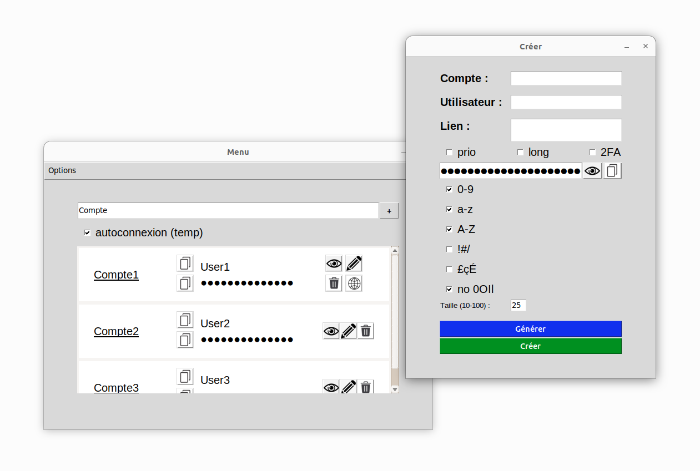
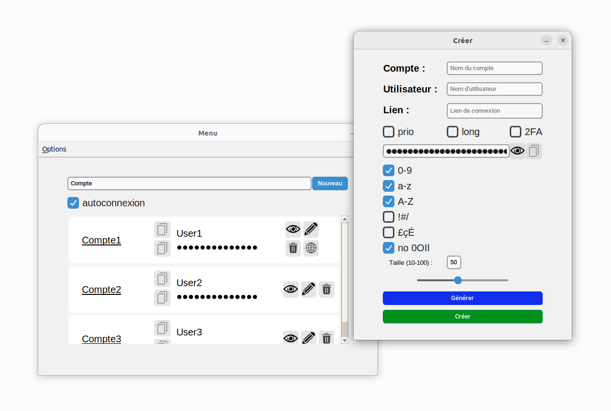

# gest_mdp
Password manager with automatic connection

<table align="right">
  <tr><td><a href="README.md"> Français</a></td></tr>
  <tr><td><a href="README_en.md"> English</a></td></tr>
</table>

<details>
<summary><b> 🆕 - New features</b></summary><br>

+ Many bug fixes and stability improvements.
+ Many GUI improvements.
+ Added keyboard shortcuts.
+ Automatic generation of passwords when changing generation parameters.
+ Changed GUI from Tkinter to [CustomTkinter](https://github.com/TomSchimansky/CustomTkinter):
#### Tkinter (before) :<br>
<br>
#### CustomTkinter (after) :<br>


</details>


<details>
<summary><b> ‍⚙️ - Installation</b></summary><br>

```bash
git clone https://github.com/Th3o-D/gest_mdp.git
cd gest_mdp
pip install -r requirements.txt
```
If you also want to take advantage of the functionality
automatic connection, you must install a driver
for your browser. For this, go to
[selenium's page] (https://selenium-python.readthedocs.io/installation.html#drivers)
and download the driver corresponding to your browser.

Note that by default, only Chrome and Firefox browsers are supported.
However, you can use other browsers by adding
your own connection functions to the `gest_mdp/web.py` file.


### Utilisation de Chrome
By default, the browser used is Firefox, but you can
use Chrome by commenting on the two lines calling `connexion_firefox()`
and decommeting the two lines calling `connexion_chrome_1()` or
`connexion_chrome_2()` (if one of the two connection functions does not work,
try the other). You must also enter the path to
the driver in the function `connexion_chrome_1()` or `connexion_chrome_2()`
in the `gest_mdp/web.py` file.
</details>

<details>
<summary><b> 💻 - Software use</b></summary><br>

### Linux
+ <ins>Option 1 :</ins> Directly launch the program from a terminal :
`python3 /path/to/gest_mdp/main.py`


+ <ins>Option 2 :</ins> Add the execution rights to `main.py`, then create a keyboard shortcut containing the
command `/path/to/gest_mdp/main.py`


+ <ins>Option 3 :</ins> Use the `gest.desktop` file provided in the `additional_resources/` folder.
You must give execution rights to the files `gest.desktop` and `main.py`. Then you have to modify the
paths in the `gest.desktop` file so that they correspond to your installation. Finally, you have to copy the file
in the `~/.local/share/applications/` folder. This solution will make the application available in the list of your
applications.

### Windows
+ <ins>Option 1 :</ins> Directly launch the program from a terminal :
`python C:\path\to\gest_mdp\main.py`


+ <ins>Option 2 :</ins> Use the `gest.bat` file provided in the `additional_resources/` folder.
You have to modify the paths in the `gest.bat` file so that they correspond
to your installation. You can then either use this file directly,
either create a shortcut to this file, which will allow you to define a
icon. An image in the right format, `logo.ico` is also available in the folder
`additional_resources/`.

</details>

<details>
<summary><b> 🛠 - Features</b></summary><br>

### Add a password

You can store new passwords by clicking on the `Nouveau` button
or in `Options > Données > Nouveau compte`. Only the name of the account
and the password are compulsory.

+ The checkbox `Lien` correspond to the connection page for which you wish to
set up the automatic connection for this account (include the whole link with https://).

+ The checkbox `prio` allows you to define a priority for automatic connection
(eg if you have several Amazon accounts).

+ The checkbox `long` makes it possible to put a delay if a site is particularly
long to load, the automatic connection can fail in this case if you do not add a
delay (eg openclassrooms).

+ The checkbox `2FA` indicates that this account has a [two factor authentification](#two-factor-authentification).

+ The checkboxes below the password field correspond to the characters
to include or not in the password.

+ The checkbox `no 0OIl` avoids similar characters (eg 0 and O).

If you don't want a random password,
it is possible to seize it manually.

If the generated password is not satisfactory, you can click on the `Générer` button
to generate a new one.

### Modify a password
To modify a password, click the pencil-shaped button next to the account you
want to modify. The modification follows the same rules as adding.

### Delete a password
To delete a password, click the bin button next to the account you want to delete.

### Generate a password without saving it
If you want to generate a password without saving it, go to
`Options > Générer`. Password generation parameters are
the same as for the addition of a password.

### Automatic connection
Do not forget to specify the profile folder of your browser from
`Options > Profil > Modifier Préférences` if you want to use your usual
profile for automatic connection.

Find the profile folder of your browser (in the address bar):
- Firefox : `about:support`
- Chrome : `chrome://version/`

To use the automatic connection, launch a selenium controlled browser, click on
the globe button on an account for which you have specified a connection link.
If you have specified your profile, make sure that the browser is closed before
starting the automatic connection, the automatic connection does not support
several browsers with the same profile.

To open another website, you can click either on the globe button on another account,
or open a new tab and arrive on the connection page, the program will automatically
detect that you are on a connection page and will connect you automatically.

Note that this automatic detection only works in the last opened tab.

If you want to temporarily deactivate the automatic connection, you can uncheck
the checkbox `autoconnexion`.

### Two factor authentification
If you have activated the double authentication for an account, the application
will try to open Authy, type the account name and recover the code, to enter it
in your browser thereafter. You must therefore have Authy installed and configured
on your computer. In addition, the name of the desired account must be the same
name in Authy. You can modify the function `get_authy_code` in `double_auth.py`
to use another double authentication application (very little code is to be modified).

### Preferences
You can change preferences from `Options > Profil > Modifier Préférences`.
In addition to specifying your browser's profile folder, you can decide whether to enable automatic login by default, whether to include certain character
types in generated passwords by default, and more.

### Change user password
You can change your password from `Options > Profil > Sécurité > Modifier le mot de passe utilisateur`.

### Change encryption key
You can encrypt your data with a new encryption key from `Options > Profil > Sécurité > Changer de clé de chiffrement`.
This operation can be time consuming as it requires all data to be rewritten
(decryption with old encryption key, encryption with new key).
Expect a wait of a few seconds for a hundred accounts.

### Delete all data
You can delete all data from `Options > Profil > Sécurité > Supprimer toutes les données`.

### Copy password or username
You can copy a password or username to the clipboard by clicking the
clipboard-shaped button next to the account.

### See a password
You can see a password by clicking the eye button next to the password.

### Find an account
To search for an account, type the name of the account you are looking for
in the search bar.

### Export data
All your data is stored in the `.data/` folder in the application's directory.
You can export it by copying this folder.
In this folder, the `master_password.txt`, `salt.txt`, `store.txt` and `preferences.txt`
files contain your encrypted encryption key, salt, encrypted data and preferences respectively.

You can even synchronize your data on several devices, for this you must have installed
the application on all the devices you want to synchronize.
As for data, you can synchronize the `.data/` folder on a storage service between your different devices.

You can also retrieve your plain data in JSON format from
`Options > Données > Exporter les données`. Please note that the file produced will
contain all your <b>unencrypted</b> data.

### Import data
You can import data from `Options > Données > Importer des données`.
The file must be in JSON format and must have been produced by the application,
if the data is not in the correct format, the application ignores the file.

If an account with the same name already exists, the application lets you choose
to overwrite the existing version, ignore the version being imported, or rename
the version being imported. If you choose one of the first two options, you have
the option of applying the same choice for all the other accounts that follow.
If during the import you open another window of the application, press `Annuler`
or close the dialog box, the import in its entirety will be cancelled.

### Persistent connection
Under Linux, the connection to the software will be persistent, you will not need
to reconnect each time you launch the application, but only at the first launch
after a restart of the computer. You can still choose to lock the application by
logging out from `Options > Se déconnecter`.

</details>

<details><summary><b> 🔒 - Security</b></summary><br>
Data security follows the same principles as many other similar software. We derive
the user's password (with a salt) with a time-consuming function
(PBKDF2-HMAC-SHA256 with 1M iterations) to obtain an encryption key, a "derived" key.
(See [official recommendation](https://cryptography.io/en/latest/fernet/#using-passwords-with-fernet)
of the `cryptography` module).

This key could be directly used to encrypt the data, but this would have the
consequence of having to decrypt and re-encrypt all the data each time the user
changes his password. To avoid this, we use as encryption key a random key
generated by the `cryptography` module and we encrypt it with the "derived" key.

Security related functions are implemented in the `security.py` file.

The power of computers is bound to increase in the coming years, so the password
derivation function might need to be changed. Here are different approaches that
could be used in the future if it becomes necessary:
+ PBKDF2-HMAC with SHA512 instead of SHA256
+ Increasing the number of iterations
+ Using a different derivation function (scrypt, argon2, bcrypt, etc.) depending
on which will be deemed most secure at the time
</details>

<details>
<summary><b> 🗄️ - Code structure</b></summary><br>

. \
├── 📄 [LICENSE](./LICENSE) \
├── 📄 [README.md](./README.md) \
├── 📄 [README_en.md](./README_en.md) \
├── 📄 [main.py](./main.py) \
├── 📄 [gest.py](./gest.py) \
├── 📄 [control.py](./control.py) \
├── 📄 [double_auth.py](./double_auth.py) \
├── 📄 [fonctions.py](./fonctions.py) \
├── 📄 [requirements.txt](./requirements.txt) \
├── 📄 [scroll.py](./scroll.py) \
├── 📄 [security.py](./security.py) \
├── 📄 [web.py](./web.py) \
├── 📁 [additional_resources](./additional_resources) \
│&nbsp;&nbsp;&nbsp;&nbsp;&nbsp;&nbsp;&nbsp;&nbsp;├── 📄 [gest.bat](./additional_resources/gest.bat) \
│&nbsp;&nbsp;&nbsp;&nbsp;&nbsp;&nbsp;&nbsp;&nbsp;└── 📄 [gest.desktop](./additional_resources/gest.desktop) \
├── 📁 [images](./images) \
│&nbsp;&nbsp;&nbsp;&nbsp;&nbsp;&nbsp;&nbsp;&nbsp;├── 📄 [copier.png](./images/copier.png) \
│&nbsp;&nbsp;&nbsp;&nbsp;&nbsp;&nbsp;&nbsp;&nbsp;├── 📄 [crayon.png](./images/crayon.png) \
│&nbsp;&nbsp;&nbsp;&nbsp;&nbsp;&nbsp;&nbsp;&nbsp;├── 📄 [oeil.png](./images/oeil.png) \
│&nbsp;&nbsp;&nbsp;&nbsp;&nbsp;&nbsp;&nbsp;&nbsp;├── 📄 [oeil_a.png](./images/oeil_a.png) \
│&nbsp;&nbsp;&nbsp;&nbsp;&nbsp;&nbsp;&nbsp;&nbsp;├── 📄 [poubelle.png](./images/poubelle.png) \
│&nbsp;&nbsp;&nbsp;&nbsp;&nbsp;&nbsp;&nbsp;&nbsp;└── 📄 [web.png](./images/web.png) \
└── 📁 [readme_documents](./readme_documents) \
&nbsp;&nbsp;&nbsp;&nbsp;&nbsp;&nbsp;&nbsp;&nbsp;&nbsp;&nbsp;&nbsp;&nbsp;├── 📄 [new.png](./readme_documents/new.png) \
&nbsp;&nbsp;&nbsp;&nbsp;&nbsp;&nbsp;&nbsp;&nbsp;&nbsp;&nbsp;&nbsp;&nbsp;└── 📄 [old.png](./readme_documents/old.png)

</details>


https://user-images.githubusercontent.com/80580619/205418244-770941eb-55e1-4142-aa34-a60320952aa0.mp4

https://user-images.githubusercontent.com/80580619/205418250-b0da6ad6-a7ba-40d7-b791-51390fdfc477.mp4


<div align="right" style="display: flex">
    
    <a href="https://github.com/Th3o-D" alt="https://github.com/Th3o-D"></a>
    <a href="LICENSE" alt="license"></a>
</div>
